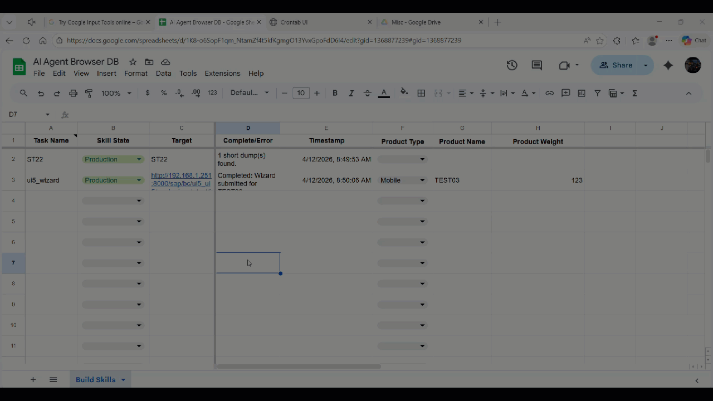

# SAP Vision Agent 🤖👁️

An autonomous, self-healing Robotic Process Automation (RPA) agent for both legacy SAP WebGUI and modern SAP UI5/Fiori applications. Built with Node.js and Playwright, this agent leverages local Vision-Language Models (VLMs) via Ollama to dynamically navigate complex SAP environments, overcoming the notorious challenges of dynamic/ephemeral HTML IDs and aggressive frontend re-rendering.

This project implements a **Finite State Machine (FSM)** to achieve Level 5 autonomy, allowing the bot to organically train, test, execute, and self-heal without human micromanagement. It also features a real-time **Telegram ChatOps Gateway** with **Conversational Slot Filling**, allowing you to converse naturally with the bot to set execution parameters before approving payloads directly from your phone.

> **Human:** Hey, can you run the ST22 dump analysis for me?
> 
> **SAP Vision Agent:** I can certainly run the ST22 dump analysis for you. Could you please provide the start date and end date for the analysis?
> 
> **Human:** From April 10th to April 14th.
> 
> **SAP Vision Agent:** ✅ **Task Ready:** `st22`
> `[ 🚀 Execute Task ]` `[ ❌ Cancel ]`

## 🎬 See it in Action

### 1. Interactive Training Phase (AI Vision & Context Switching)

*Watch the agent inject Set-of-Mark (SoM) boxes to visually map the legacy SAP DOM using AI, and then seamlessly switch to pure native Playwright locators for the modern UI5 app.*


### 2. Headless Batch Execution (Zero-Token Memory)

*Once trained, the agent relies entirely on its `skill.json` cache. Watch it fly through the legacy transaction and UI5 app entirely in the background, without requiring AI inference or rendering visual boxes.*



-----

## ✨ Key Features

  * **🎛️ Universal Mega-Sheet FSM Orchestrator:** The FSM is entirely controlled via a dynamic Google Sheet. Tasks cycle through explicit states:
      * `Needs Training`: Flushes the memory cache and forces the agent to map the UI using AI/Human logic.
      * `Testing`: Runs a strict autonomous unit test. If successful, it promotes itself to Production.
      * `Production`: Silent, lightning-fast execution using zero-token cached memory or pure native locators.
      * `Broken`: If a production run crashes (e.g., SAP updates its UI), the bot automatically demotes the task to `Broken`, captures a phase-specific crash screenshot, and drops back into training mode on the next run.
  * **💬 Enterprise ChatOps Gateway:** A decoupled event-driven Telegram server that streams real-time execution logs, formats dynamic AI summaries, and automatically uploads crash screenshots and generated JSON artifacts straight to your mobile device.
  * **🧠 Conversational Slot Filling & HITL Execution:** Instead of rigid commands, the AI acts as a conversational gatekeeper. It reads a `# PARAMETERS` schema, identifies missing slots in your natural language request, interviews you to gather the missing data, and safely pauses for a Human-in-the-Loop (HITL) button confirmation before injecting the Base64 JSON payload into Playwright.
  * **🎙️ Natural Language & Voice Routing:** Speak directly to the bot using Telegram voice memos! Audio is converted to text via a local STT microservice and fed into a global `system_prompt.md`. Ollama then parses your intent and matches it to the correct task dynamically.
  * **🛤️ Dynamic URL Routing & Payload Injection:** The Orchestrator automatically parses dynamic headers from Row 1. It seamlessly routes both legacy WebGUI T-Codes and direct UI5 URLs, passing the entire row's data as a JSON payload (`taskData`) to your scripts for highly parameterized runs.
  * **🛡️ Multi-Layered Locator Shields:** Actively validates that the AI selected typeable `<input>` fields and detects if a modern framework (like UI5) asynchronously re-renders and destroys target elements while the AI is thinking.
  * **👻 Anti-Ghosting & Graceful ITS Logoffs:** Headless bots that rapidly terminate browsers often leave "Ghost Sessions" alive in the SAP backend, which eventually exhausts ITS memory and causes `HTTP 500 Internal Server Errors`. The Orchestrator prevents this by executing a graceful `~transaction=logoff` HTTP signal before killing the Chromium process.
  * **⚡ Global AI Circuit Breaker:** If the AI fails cumulatively across a transaction, the bot trips a global circuit breaker, bypassing the VLM for the rest of the run and dropping to manual Human-in-the-Loop mode.
  * **🧬 Adaptive Phase-Gate Architecture:** Intelligently switches execution strategies based on the target environment (Legacy Visual AI vs. Modern Native Locators).

## 📂 Project Structure

```text
sap-vision-agent/
├── agent.js              # The main FSM Orchestrator script
├── gateway.js            # The Telegram ChatOps server (Real-time listener & Session Memory)
├── system_prompt.md      # Top-level JSON state machine instructions for the AI
├── helpers/              # Core utilities
│   ├── dom.js            # Omni-frame locators and SoM injection
│   ├── human.js          # HITL terminal prompts & headless failsafes
│   ├── logger.js         # Timezone-aware, self-cleaning logging
│   ├── skill.js          # JSON caching logic (readSkill, writeSkill, purgeSkill)
│   ├── sheet.js          # Google Sheets API Mega-Sheet parsing
│   ├── vision.js         # Optimized Ollama Vision API requests
│   └── telegram.js       # The ChatOps adapter (HTML formatting, limits, buttons)
├── sap_transports/       # Pre-packaged SAP ABAP Transports (SEGW/SE11 artifacts)
├── tasks/                # Application-specific logic plugins (Directory-based)
│   ├── st22/             
│   │   ├── st22.js       # Legacy WebGUI task: AI Vision & Extractor logic
│   │   └── task.md       # AI intent & parameter schema for the routing brain
│   └── ui5_wizard/       
│       ├── ui5_wizard.js # Modern UI5 task: Phase-Gate & Native Locators
│       └── task.md       # AI intent & parameter schema for the routing brain
├── skills/               # (Auto-generated) Memory banks and Skill.md prompts
├── downloads/            # (Auto-generated) Extracted raw text feeds and JSON analysis
├── screenshots/          # (Auto-generated) Current run visuals & crash reports
├── logs/                 # Standard output logs for Headless/Cron execution
├── demo/                 # Presentation GIFs for GitHub README
├── .env                  # Environment configuration (ignored in git)
└── package.json
```

## 📊 Google Sheet Structure (The Mega-Sheet)

Your Google Sheet drives the Batch Orchestrator. The headers in Row 1 are mapped dynamically to the `taskData` object injected into your scripts.

| Task Name (Col A) | Skill State (Col B) | Target (Col C) | Complete/Error | Timestamp | Product Type | Product Name | Product Weight |
| :--- | :--- | :--- | :--- | :--- | :--- | :--- | :--- |
| `st22` | Production | `ST22` | 0 short dumps found. | 4/12/2026, 7:25 AM | | | |
| `ui5_wizard` | Production | `http://<ip>/index.html` | Completed | 4/12/2026, 7:25 AM | Mobile | TEST03 | 123 |

## ⚙️ Installation & Setup

1.  **Clone the repository:**

    ```bash
    git clone [https://github.com/nungbin/sap-vision-agent.git](https://github.com/nungbin/sap-vision-agent.git)
    cd sap-vision-agent
    ```

2.  **Install dependencies:**

    ```bash
    npm install
    npm install node-telegram-bot-api
    npx playwright install chromium
    npx playwright install-deps # Required for headless Linux environments
    ```

3.  **Configure Environment Variables:**
    Create a `.env` file in the root directory:

    ```env
    # SAP Credentials
    SAP_WEBGUI_URL="http://YOUR_SAP_IP:PORT/sap/bc/gui/sap/its/webgui?sap-client=001&sap-language=EN"
    SAP_USER="your_username"
    SAP_PASS="your_password"

    # Ollama Vision Configuration
    OLLAMA_URL="http://YOUR_OLLAMA_IP:11434/api/chat"
    OLLAMA_MODEL="gemma4:e2b" 

    # Google Sheets Configuration
    GOOGLE_SHEET_ID="your_google_sheet_id_here"
    GOOGLE_APPLICATION_CREDENTIALS="./google-credentials.json"

    # ChatOps Gateway Configuration
    TELEGRAM_BOT_TOKEN="your_telegram_bot_token"
    STT_TTS_URL="http://YOUR_STT_IP:3000" # Optional: For voice microservices

    # Logging Preferences
    LOG_TIMEZONE="America/Edmonton"

    # Execution Mode
    HEADLESS="TRUE" # Set to FALSE for local development
    ```

## 🎙️ Speech-to-Text (STT) Microservice Setup

To fully utilize the Voice Memo Natural Language Intent features in Telegram, the Gateway requires a local CPU/GPU-based STT microservice.

For the complete STT server source code and Docker/LXC setup instructions, please refer to:
🔗 [https://github.com/nungbin/ai-agent-browser](https://github.com/nungbin/ai-agent-browser)

## 📦 SAP Backend Setup (OData & Transports)

For tasks that require direct backend API communication (such as the modern UI5 Wizard PoC saving data to SAP), you will need the corresponding ABAP artifacts (Z-Tables and SEGW OData services).

### Option A: Import via SAP Transports (Recommended)
We have pre-packaged the backend artifacts into standard SAP Transports located in the `sap_transports/` directory (`K900123.NPL` and `R900123.NPL`).

Please refer to this document for step-by-step instructions on importing these into your SAP NetWeaver system:
🔗 [How to Import SAP Transports](https://github.com/nungbin/ai-agent-browser/blob/main/sap_abap_sources/transports/How_to_Import_SAP_Transports.md)

### Option B: Manual Creation (SE11 & SEGW)
If you prefer to build the backend manually:
1. **Create the Database Table (SE11):** Create a standard transparent table (e.g., `ZPROD_WIZARD`) with fields matching your UI5 payload.
2. **Generate the OData Service (SEGW):** Create a new project, map the DDIC structure, and generate runtime objects.
3. **Implement ABAP Logic:** Edit the generated `*DPC_EXT` class to `INSERT` the record into your Z-Table.
4. **Register Service:** Use transaction `/IWFND/MAINT_SERVICE` to activate the service.

## 📱 Setting up the Telegram ChatOps Bot

To control the agent from your phone, you need to register a bot with Telegram's BotFather:

1.  Open Telegram and search for **@BotFather** (look for the verified blue checkmark).
2.  Start the chat and send the command: `/newbot`
3.  Give your bot a display name and unique username ending in "bot" (e.g., `sap_hpa6_bot`).
4.  Copy the **HTTP API Token** into your `.env` file under `TELEGRAM_BOT_TOKEN`.
5.  *(Optional)* Send `/mybots` to BotFather, select your bot -> Bot Settings -> Group Privacy -> **Turn Off**. This allows the bot to listen to natural language in team chats.

## 💻 Usage & Execution Modes

The bot dynamically adapts to your deployment environment.

### 1. Interactive Mode (Local Development & Training)
Runs locally. Pops open the browser, enables Human-in-the-Loop (`askHuman`) terminal prompts, and allows you to watch the agent learn.
```bash
HEADLESS=false VERBOSE=true node agent.js
```

### 2. Headless Mode (Cloud / Production / Crontab)
Runs purely off the Google Sheet batch queue. Bypasses terminal prompts and writes all diagnostics to the `screenshots/` directory.
```bash
HEADLESS=true node agent.js
```

### 3. ChatOps Mode (Telegram Gateway & Conversational AI)
Leave the gateway running to create an always-on listener that bridges Telegram to your CLI via a Stateful AI Session Manager.
```bash
node gateway.js
```

#### Conversational Testing Scenarios (UI5 Wizard)
You do not have to say "run ui5" first. The AI routing brain reads your natural English, matches it to the UI5 task, and extracts variables conversationally.

* **Scenario 1: The "One-Shot" Execution**
    * **Human:** *"Can you create a new Desktop product named TITAN_PRO that weighs 5.5 kg?"*
    * **AI:** Bypasses the interview, fills all slots, and immediately presents the execution button.
* **Scenario 2: The "Vague / Lazy" Request (Testing Schema Defaults)**
    * **Human:** *"Hey, run the product creation wizard for me."*
    * **AI:** Silently applies `task.md` schema defaults (Mobile, TEST_PROD_01, 1 kg) and asks for final confirmation.
* **Scenario 3: The "Multi-Turn Interview" (Conversational Memory)**
    * **Human:** *"I need to add a new Tablet to the system."*
    * **AI:** *"Sure! What would you like to name this Tablet, and what is its weight?"*
    * **Human:** *"Let's name it GALAXY_TAB. It weighs 1.2 kg."*
    * **AI:** Combines the memory from both turns and presents the execution payload.
* **Scenario 4: The "Pre-Flight Correction"**
    * **Human:** *"Wait, actually change the weight to 0.5 kg."*
    * **AI:** Remembers the product type and name, updates only the weight slot, and regenerates the confirmation button.
* **Scenario 5: The "Hard Pivot" (Memory Wipe)**
    * **Human:** *"Actually, never mind. Can you check ST22 for short dumps from yesterday instead?"*
    * **AI:** Triggers a `PIVOT`, wipes the UI5 memory session, loads the ST22 schema, and adapts to the new intent instantly.

#### Conversational Testing Scenarios (ST22 Dump Analysis)
* **Scenario 1: The "One-Shot" Execution**
    * **Human:** *"Run ST22 for user JSMITH from April 1st to April 5th."*
    * **AI:** Extracts all explicit dates and users, skipping the interview.
* **Scenario 2: The Defaults & Relative Dates**
    * **Human:** *"Can you check the system for short dumps?"*
    * **AI:** Realizes the user is missing, applies the default `*` (system-wide) from the schema, and prompts for dates.
    * **Human:** *"Just from yesterday to today."*
    * **AI:** Calculates the relative dates and builds the final JSON payload.

## ⏳ Headless Background Scheduling (Crontab-UI)

To run the agent autonomously in a Linux LXC or cloud container, we use `crontab-ui` as our background scheduler.

**1. Install Crontab-UI Globally:**
```bash
npm install -g crontab-ui
```

**2. Start the Web Dashboard:**
Bind it to `0.0.0.0` so you can access the dashboard over your local network (`http://<your-server-ip>:8000`):
```bash
HOST=0.0.0.0 crontab-ui
```

**3. Configure the Cron Job:**
Create a new job using absolute paths. Append output to a log file:
* **Command:** `cd /home/YOUR_USER/projects/sap_agent && /usr/bin/node agent.js >> logs/cron.log 2>&1`
* **Schedule:** `*/5 * * * *` 

## 🏗️ How to Add New Tasks (Directory Structure)

1.  **Update the Mega-Sheet:** Add a new row to your Google Sheet. Set the *Task Name*, *Skill State* (`Needs Training`), and *Target*.
2.  **Create the Folder & Script:** Create a new folder inside `tasks/` matching the Task Name exactly (e.g., `tasks/su01/su01.js`).
3.  **Add `task.md` (The Schema):** Create a markdown file with an `# INTENT` block and a `# PARAMETERS` list. Describe the data types and fallback defaults here so the AI knows how to interview the user.
4.  **Build the Logic:** Export an asynchronous function. Use `helpers.taskData` to unpack the dynamic JSON payload extracted by the AI or Google Sheet.
5.  **Execute:** The Orchestrator will handle the FSM states, system login, URL routing, payload injection, dynamic ChatOps reporting, AI routing, and self-healing.